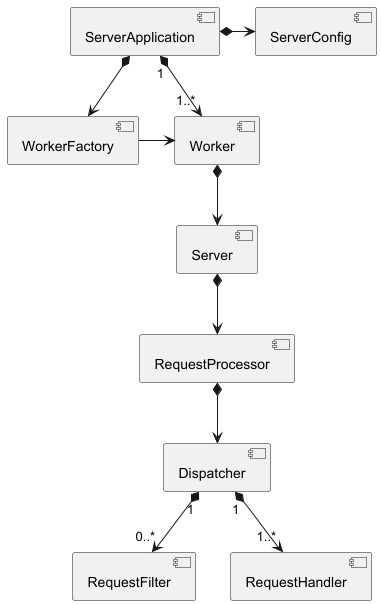
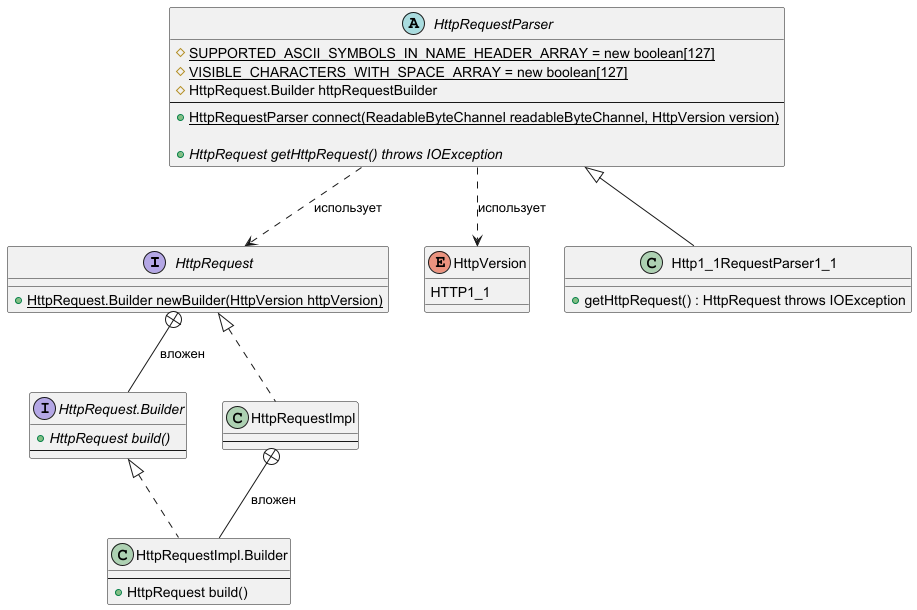
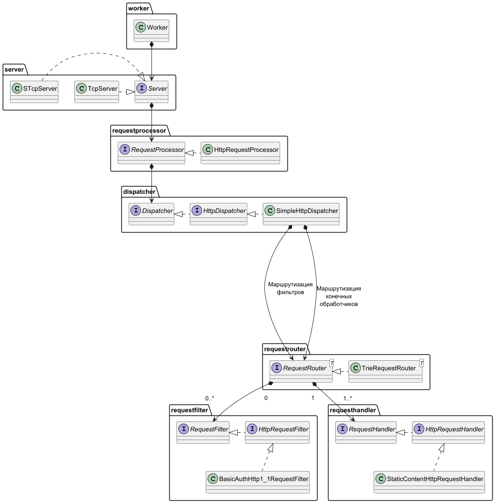
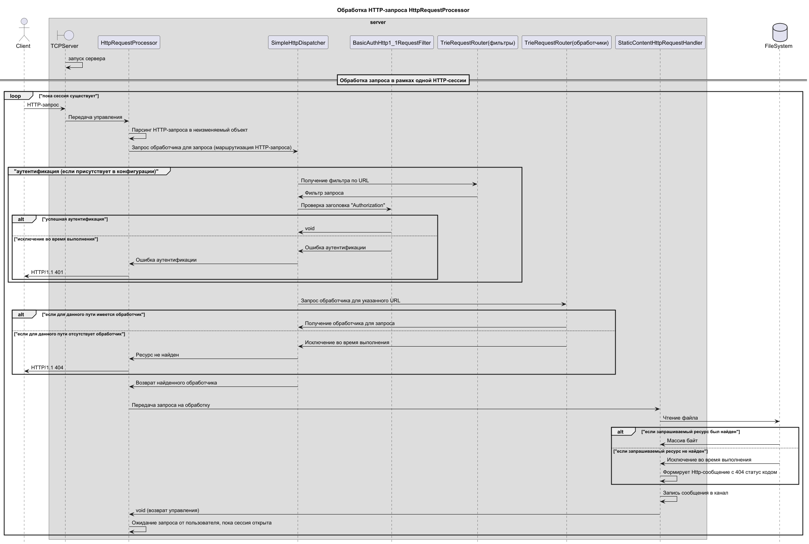

# Sparrow

### HTTP-сервер с аутентификацией и поддержкой GOST-TLS (при указании пути к библиотекам Крипто ПРО)

#### Сервер написан на Java версии 21. Для обработки запросов используется паттерн [thread-per-request на виртуальных потоках](https://docs.oracle.com/en/java/javase/21/core/virtual-threads.html).

## Архитектура сервера

#### Описание архитектуры:

* **ServerConfig** - компонент, отвечающий за загрузку и хранение конфигурации приложения.
* **WorkerFactory** - компонент, создающий экземпляры компонентов «Worker» на основе загруженной конфигурации.
* **ServerApplication** - компонент, управляющий жизненным циклом приложения, включая получение конфигурации от
  «ServerConfig», создание контекста приложения (содержащего компоненты «Worker» и другие настройки) с использованием
  «WorkerFactory», запуск компонентов «Worker» и завершение работы приложения с корректным освобождением ресурсов.
* **Worker** - компонент системы, обрабатывающий все входящие подключения на определенном сетевом порту. Таких компонентов
  может быть несколько, для обработки одним приложением нескольких протоколов.
* **Server** - компонент, который взаимодействует с операционной системой для приема и перенаправления входящих соединений
  на обработку. Он выполняет функцию точки входа для внешних запросов и направляет их на соответствующий обработчик
  запросов.
* **RequestProcessor** - компонент, выполняющий обработку входящих запросов в рамках установленного соединения
  по-определённому протокол.
* **Dispatcher** - компонент, осуществляющий маршрутизацию запроса к соответствующему обработчику. Перед маршрутизацией
  данный компонент проверяет наличие фильтра для данного маршрута и, при его наличии, передает запрос сначала фильтру, а
  затем конечному обработчику.
* **RequestFilter** - компонент, проверяющий запрос на соответствие определенным критериям, осуществляя «фильтрацию»
  запроса, поступившего от клиента.
* **RequestHandler** - компонент, выполняющий конечную обработку запроса, поступающих от клиента, реализуя основную логику
  приложения и являясь последним звеном в процессе обработки запросов

## Диаграмма классов синтаксического анализатора HTTP-запросов (HTTP-парсера)

## Диаграмма классов компонентов и подкомпонентов "Worker" для обработки статического контента с диска по протоколу HTTP

## Диаграмма последовательности для запроса статического контента по протоколу HTTP

